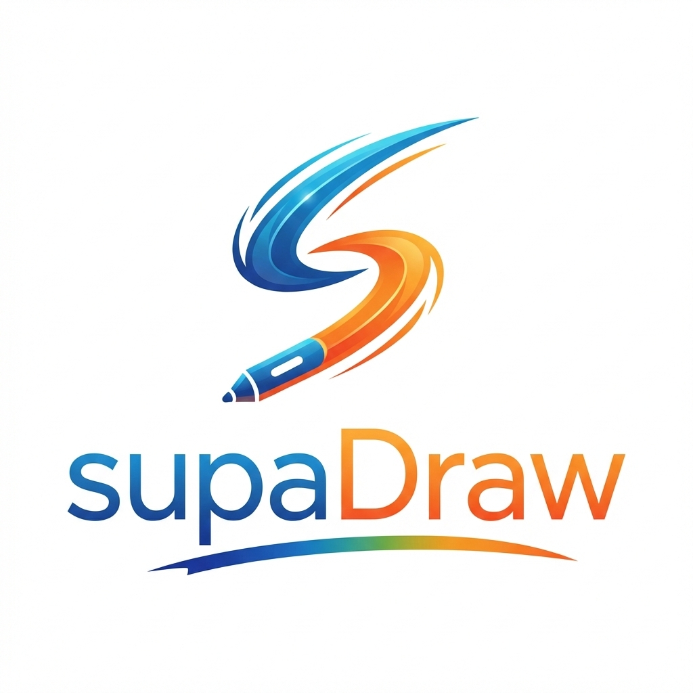

<p align="center">
  
</p>

<h1 align="center">supaDraw</h1>

<p align="center">
  <strong>Etkileşimli Tahtalarda Kullanılmak Üzere Tasarlanmış Kalem Uygulaması</strong>
</p>

<p align="center">
  
  
  
  
</p>

---

## 📖 Hakkında

**supaDraw**, ekran üzerine eklediği şeffaf katman ile her türlü görüntü üzerinde işlem yapabilmenizi sağlayan hızlı ve pratik bir kalem programıdır.

- 📚 Ders kitaplarında soru çözerken
- 🖼️ Resimler üzerinde değişiklik yaparken
- 🌐 İnternet sitelerindeki bilgileri vurgularken
- 🎥 Hareket halindeki videoları izletirken

…istediğiniz an kalemi kullanabilirsiniz. Öğretmenlerin en verimli şekilde çalışabilmeleri için tasarlanmıştır.

---

## ✨ Özellikler

| Özellik | Açıklama |
|---|---|
| 🎨 **Çizim Araçları** | Kalem, fosforlu kalem, kesik uçlu kalem (Arapça dersleri için), silgi |
| 📐 **Şekil Araçları** | Çizgi, dikdörtgen, daire, ok — canlı önizleme ile |
| ↩️ **Geri / İleri Alma** | Sınırsız undo/redo desteği |
| 📄 **Arka Plan Sayfaları** | Şeffaf, beyaz tahta, kareli, çizgili, noktalı, kara tahta |
| 🎭 **Perdeleme** | Tam perde ve spotlight modu — öğrencilerin odaklanması için |
| 🖼️ **Resim Ekleme** | Dosyalarınızdan görseller ekleyin, kalite bozulmadan üzerinde çalışın |
| 🔧 **Taşınabilir Toolbar** | Sürüklenebilir, her zaman üstte kalan araç çubuğu |
| 🖥️ **Mod Geçişi** | Tek tuşla çizim ve masaüstü modu arasında kusursuz geçiş |
| 📑 **Çoklu Sayfa** | Sayfa ekleyin, sayfalar arası gezinin |
| 🎨 **Renk Paleti** | 10 hazır renk + özel renk seçici |
| 💾 **Otomatik Kayıt** | Ayarlar ve tercihler otomatik kaydedilir |

---

## 🚀 Kurulum

### Gereksinimler

- Python 3.10 veya üzeri
- PyQt5

### Adımlar

```bash
# Depoyu klonlayın
git clone https://github.com/yourusername/supaDraw.git
cd supaDraw

# Bağımlılıkları yükleyin
pip install -r requirements.txt

# Uygulamayı başlatın
python3 main.py
```

---

## 🎮 Kullanım

### Mod Geçişi

supaDraw iki modda çalışır:

| Mod | Açıklama | Geçiş |
|---|---|---|
| ✏️ **Çizim Modu** | Ekran üzerinde çizim yaparsınız | Toolbar'daki ✏️ butonuna tıklayın |
| 🖥️ **Masaüstü Modu** | Alttaki uygulamaları kullanırsınız, toolbar görünür kalır | Toolbar'daki 🖥️ butonuna tıklayın |

### Araç Çubuğu

| Bölüm | İçerik |
|---|---|
| **Çizim Araçları** | ✏️ Kalem · 🖍️ Fosforlu · 🖌️ Kesik Uç · 🧹 Silgi |
| **Şekil Araçları** | ╱ Çizgi · ▭ Dikdörtgen · ○ Daire · → Ok |
| **Renk Paleti** | 10 renk + özel renk seçici |
| **Kalınlık** | Kaydırıcı ile ayarlama |
| **İşlemler** | ↩ Geri Al · ↪ İleri Al · 🗑 Temizle · 🖼 Resim · 🎭 Perde |
| **Arka Plan** | 🔲 Şeffaf · ⬜ Beyaz · 📏 Kareli · 📝 Çizgili · ⚫ Kara Tahta |
| **Sayfa** | ◀ Önceki · ▶ Sonraki · ＋ Yeni Sayfa |

### Klavye Kısayolları

| Kısayol | İşlev |
|---|---|
| `Ctrl+Z` | Geri al |
| `Ctrl+Y` | İleri al |
| `1` – `9` | Hızlı renk değiştirme |
| `+` / `-` | Kalem kalınlığı ayarı |
| `Fare Tekerleği` | Kalem kalınlığı ayarı |
| `F1` | Toolbar'ı yanınıza çağırın |
| `F5` | Perdeleme modu geçişi |

---

## 📁 Proje Yapısı

```
supaDraw/
├── main.py                 # Uygulama giriş noktası
├── logo.png                # Uygulama ikonu
├── requirements.txt        # Python bağımlılıkları
├── README.md               # Bu dosya
└── src/
    ├── __init__.py
    ├── canvas.py           # Çizim motoru — stroke, şekil, undo/redo
    ├── toolbar.py          # Glassmorphism floating araç çubuğu
    ├── tools.py            # Araç tanımları ve veri yapıları
    ├── backgrounds.py      # Arka plan desenleri (kareli, çizgili, vb.)
    ├── curtain.py          # Ekran perdeleme — tam perde ve spotlight
    ├── image_manager.py    # Resim içe aktarma ve kütüphane
    └── settings.py         # JSON tabanlı ayar yönetimi
```

---

## 🏗️ Mimari

```
┌──────────────────────────────────────────────────────┐
│                    OverlayWindow                      │
│  ┌─────────────────────────────────────────────────┐ │
│  │              DrawingCanvas                       │ │
│  │  • Şeffaf katman (ekranın tamamını kaplar)      │ │
│  │  • Stroke yönetimi (Bézier eğrileri)            │ │
│  │  • Şekil çizimi (canlı önizleme)               │ │
│  │  • Sayfa yönetimi                               │ │
│  │  • Undo/Redo stack                              │ │
│  ├─────────────────────────────────────────────────┤ │
│  │              CurtainOverlay                      │ │
│  │  • Tam perde modu                               │ │
│  │  • Spotlight modu                               │ │
│  └─────────────────────────────────────────────────┘ │
└──────────────────────────────────────────────────────┘
        ↕ Sinyaller
┌──────────────────────┐     ┌─────────────────────┐
│   FloatingToolbar    │     │    SystemTrayIcon    │
│  • Araç seçimi       │     │  • Mod geçişi        │
│  • Renk seçimi       │     │  • Hızlı çıkış       │
│  • Sürükle-bırak     │     └─────────────────────┘
└──────────────────────┘
```

---

## 🤝 Katkıda Bulunma

1. Bu depoyu fork edin
2. Yeni bir dal oluşturun (`git checkout -b ozellik/yeni-ozellik`)
3. Değişikliklerinizi commit edin (`git commit -m 'Yeni özellik ekle'`)
4. Dalınıza push edin (`git push origin ozellik/yeni-ozellik`)
5. Pull Request açın

---

## 📄 Lisans

Bu proje MIT Lisansı altında lisanslanmıştır. Detaylar için [LICENSE](LICENSE) dosyasını inceleyin.

---

<p align="center">
  <strong>supaDraw</strong> — Herkes için Murat NAR -devMurat06- tarafından geliştirilmiştir.
</p>

N♥️